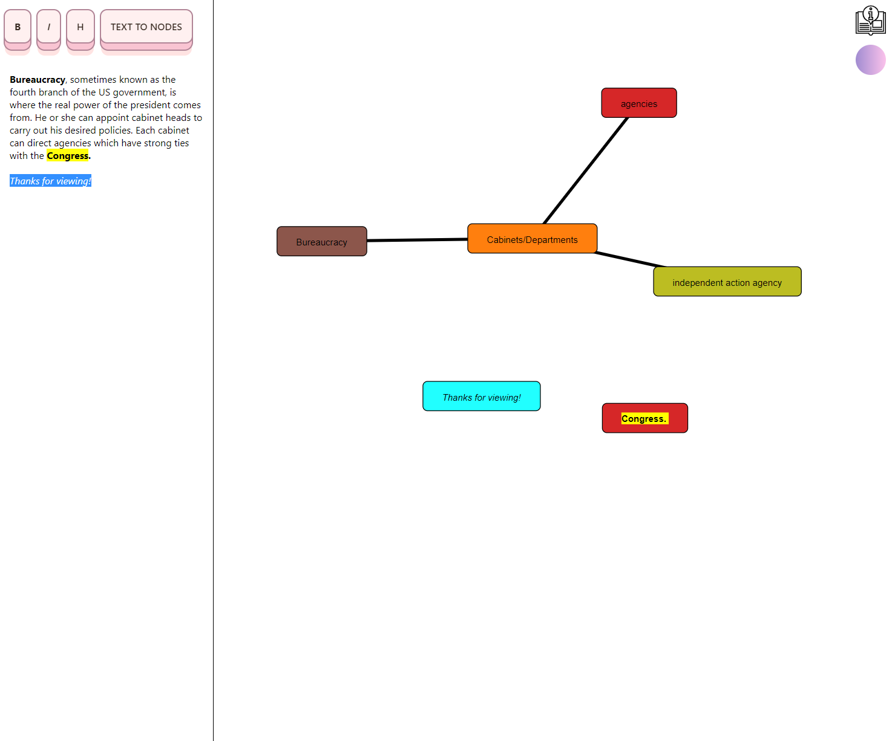

# DEMO
live at https://blastwind.github.io/Notemap.io/!

## Usage
To create fast mindmaps with a text editor on the size 
Mainly for students to summarize their studies and connect the ideas. 

## Current Progress 
I have been working on this for about 2 months on and off, If I don't land a job or have other huge commitments I am looking forward to wrap this up to a production ready app in 50 days. 

## Future Features 
  * Folders and savable notemaps for users to organize stuff 
  * ...
